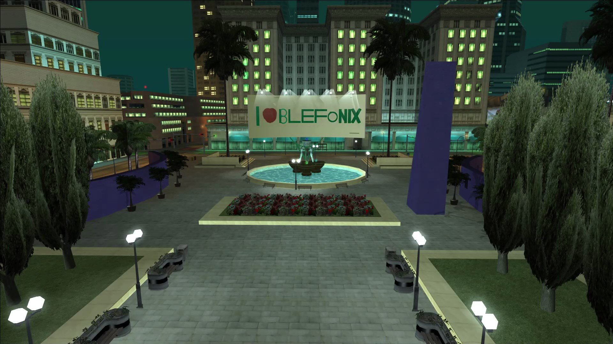

Hi all, the release of Blefonix RolePlay is getting closer. In the meantime, we're officially launching 3 full-fledged server sites. Due to their openness, they will be updated by us and the community.

[rp.blefonix.com](https://rp.blefonix.com) — the main *touch point* with the server. Here everyone will find a friend, talk heart-to-heart, and one of the first to know about the latest news of the project. As well as this website will be a connection between us and the game world by Blefonix RP.

[brp.vercel.app](https://brp.vercel.app) — the calling card of the project, the main landing page of our server. All the important links and not only in one place.

[brpsa.vercel.app](https://brpsa.vercel.app) — revolutionary solution for quickly finding important info about the server and how it all works. It's a blog and server docs. Down with the boring */menu > help*. Here the text will stay up-to-date at all times. Each of you can edit any of the pages.

Each of these sites is multilingual. Each has a dark and light theme. Welcome!

:::tip
We advise you to add [this page](https://brp.vercel.app) to your bookmarks.
:::
